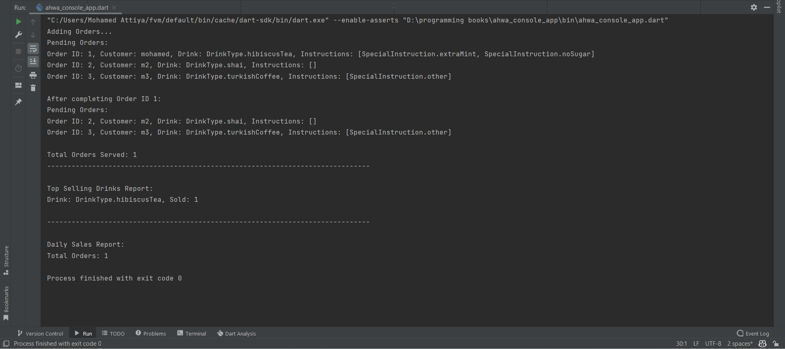

# Ahwa Console App

A simple console app that simulates a coffee shop management system. The app allows you to add orders, complete orders,
view pending orders, and generate reports on sales and popular drinks.

## Features

- Add new orders with customer name, drink type, and special instructions.
- Complete orders by order ID.
- View a list of pending orders.
- Generate reports on total orders served and top-selling drinks.

## OO && SOLID Principles Applied :

- **Dependency Inversion Principle (DIP)**: High-level modules do not depend on low-level modules. Both depend on
  abstractions. For example, `ManagerController` depends on `OrderRepository` and `ReportRepository` abstractions rather
  than concrete implementations.
- **Single Responsibility Principle (SRP)**: Each class has a single responsibility. For example, `OrderServices`
  handles order-related operations, while `ReportServices` handles report generation.
- **Liskov Substitution Principle (LSP)**: Subtypes can be substituted for their base types. For
  example, `OrderRepositoryImpl` can be used wherever `OrderRepository` is expected.
- **Open/Closed Principle (OCP)**: The system is open for extension but closed for modification. New features can be
  added by creating new classes or methods without changing existing code.
- **Inheritance and Polymorphism**: The use of abstract classes and interfaces allows for polymorphic behavior, enabling
  different implementations to be used interchangeably.

## Output 


## Getting Started

To run the application, ensure you have Dart installed on your machine. Then, execute the following command in your
terminal:

```bash
dart run bin/ahwa_console_app.dart
```

## Project Structure

- `models/`: Contains data models such as `Order` and `Report`.
- `repository/`: Contains repository interfaces and their implementations for data access.
- `data/`: Contains service implementations that interact with data storage.
- `controller/`: Contains the `ManagerController` which orchestrates the application logic.
- `lib/`: Contains the main entry point of the application.


