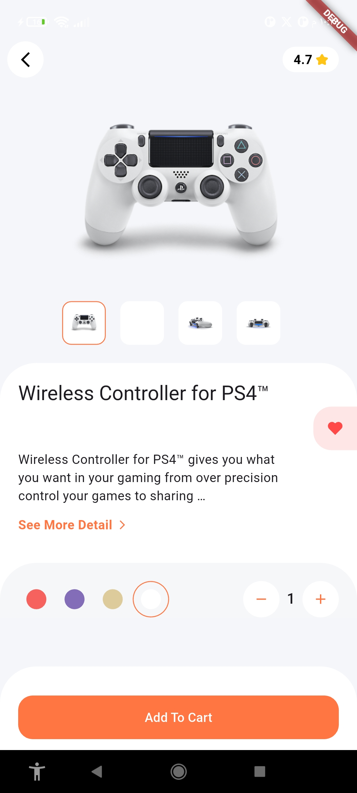
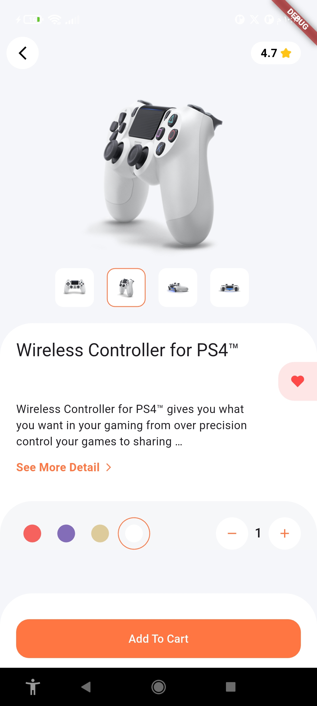
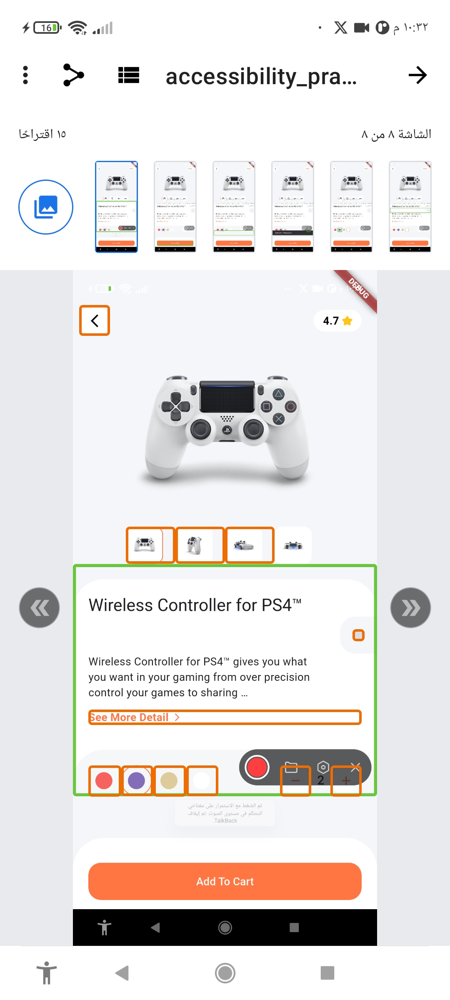
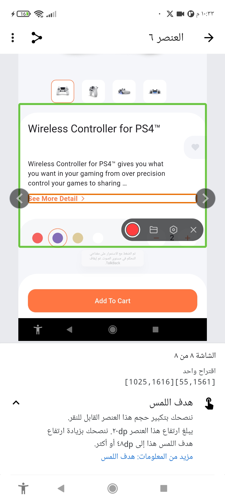
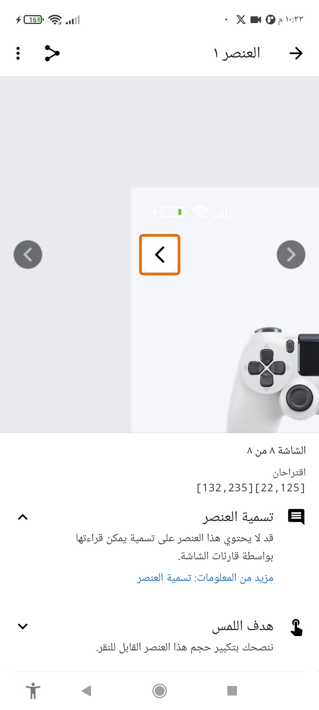
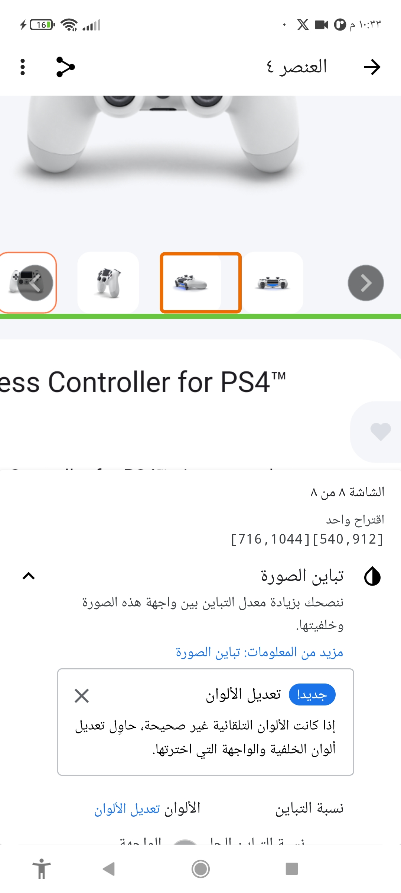

# 📖 Accessibility Practice App

A Flutter project demonstrating how to build **accessible mobile UI** using Flutter’s accessibility features like `Semantics`, `Tooltip`, and testing with Accessibility Scanner.

## 📝 Description
This project is a **Flutter application** created to practice and showcase **accessibility best practices**.  
It demonstrates how to make apps usable by **all users**, including those with visual, motor, or cognitive disabilities.

## 📱 Screenshots

|  |  |
|-------------------------------------------|----------------------------------------|
| Product Details Front Shape               | Product Details Side Shape             |

## 📱 Accessibility Scanner App

To test accessibility, use the [Accessibility Scanner](https://play.google.com/store/apps/details?id=com.google.android.apps.accessibility.auditor) app (Android).  
It helps identify accessibility issues in your app, such as missing labels, low contrast, and touch target size.

## 🕵️‍♀️ Accessibility Features

- Semantic labels for buttons, images, and interactive elements.
- Descriptive hints and values for screen readers.
- Color contrast and color name semantics for color pickers.
- Dynamic labels based on content (e.g., image descriptions).
- Keyboard navigation and focus management.

## ✅ Ways to Apply Accessibility

- Use the `Semantics` widget to provide labels, hints, and roles.
- Add descriptions to images using `Semantics(label: ...)`.
- Ensure sufficient color contrast and provide color names.
- Make all interactive elements accessible via keyboard and screen readers.
- Test with accessibility tools and real users.

## 🛠 Accessibility Scanner App Recommendations 

|  |  |
|-------------------------------------------|----------------------------------------|

|  |  |
|-------------------------------------------|----------------------------------------|

## 👌 Why Should Flutter Apps Be Accessible?

- Accessibility ensures your app is usable by everyone, including people with disabilities.
- It improves user experience and broadens your audience.
- Many countries have legal requirements for digital accessibility.
- Accessible apps are more robust and future-proof.

## 🎥 Application Accessibility Test

  <video src="https://github.com/user-attachments/assets/5ef44391-a537-455a-975a-82383774fbe3" width="400" controls></video>

## 🎥 Accessibility Scanner App Recommendations

  <video src="https://github.com/user-attachments/assets/2f36f9e8-b1d3-4515-9aa6-4015d0e399f7" width="400" controls></video>

## References

- [Flutter Accessibility Guide](https://docs.flutter.dev/development/accessibility)
- [Accessibility Widgets Catalog](https://docs.flutter.dev/ui/widgets/accessibility)
- [Flutter Accessibility Recommended Article](https://www.kodeco.com/35275067-flutter-accessibility-getting-started)

   
   

   
